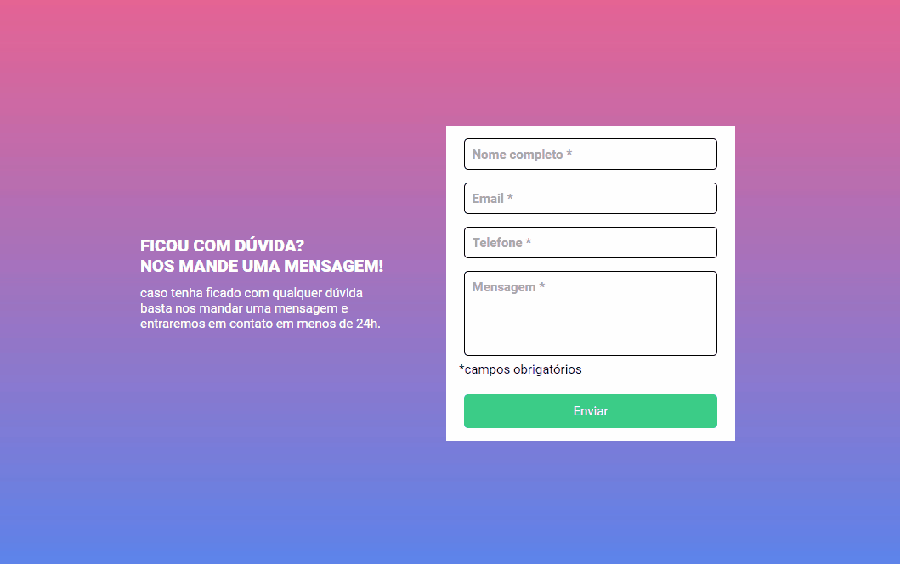

# Formulário com validação

Esse foi mais um desafio do DevQuest que consiste na criação de um formulário com validações nos campos de preenchimento. 

## Formulário

## Tecnologias utilizadas
- HTML
- CSS
- JAVASCRIPT